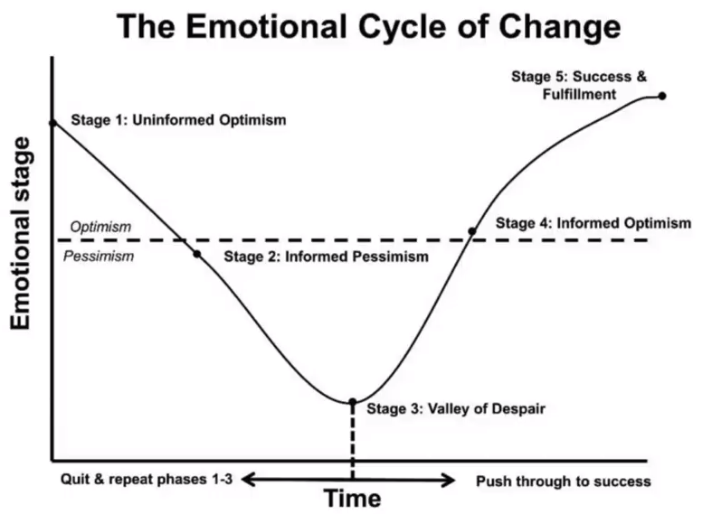

# Byteconf React 2020 - Day 1
* [YouTube](https://www.youtube.com/channel/UC046lFvJZhiwSRWsoH8SFjg)

# Simply React - Kent C. Dodds

## What this talk is
* Typical lifecycle of a component (development)
* How patterns can simplify
*

## What this talk is not
* How to implement patterns

## Accordion Example
* Accordion opens below
  * Client asks for one that opens on right
  * then left
  * then top

* side tip - don't allow impossible scenarios; make one prop to accept a value

* Allow only one at time?
* Disable closing of complete
* Allow tabs
  * "Just another `if` statement!"

### Cons
* bundle size/perf
* maintenance overhead
* implementation complexity
* API Complexity

All accordions

# A Gentle Introduction to Building Serverless Apps - Joe Karlsson

## What is serverless?
* "Would rather buy my own console to play games than build PC gaming rigs. Serverless is like that." - Kelsey Hightower
* Serverless does have servers, but it's serverless for us

## Why so popular?
* No managing of infrastructure, whatsoever
* No provisioning
* No patching
* No capacity planning
* No scaling

Studies show 77% increase in delivery speed to customers.

## What's the catch?
* Servers need to be "warmed up"
  * if more load comes in, they need to spin up additional servers to accomodate
* State must be external
* DevOps is still a thing

## When should I use?
* Occasional server needs on a static site
* Variable traffic levels
* Additional compute without extending current system
* Any web app that you want to be cheaper

## Serverless Provider considerations
* Avoid Vendor lock-in
* Works with a broad set of services
* Easy

"MongoDB Stitch is a great choice"
* QueryAnywhere
* Functions
* Triggers
* Mobile Sync
* "GraphQL can turn any MongoDB collection into serverless function"

## What's next??
* Abstraction is on the rise
* More serverless services will have a Serverless option
* MongoDB acquired Realm
* Any web app that you want to be cheaper!

# Beginner Pitfalls: My Personal Journey - Mahmoud Abdelwahab
* Having the wrong expectations
* Not having a plan
* Not mastering the fundamentals
* Stuck in tutorial hell
  * Don't let it be #1 resource to use
  * build things yourself
* Learning many things at once
* Comparing yourself to others
* Holding yourself back
* My Current Progress

# Creating a Component Library - Kathryn Grayson Nanz
## Issues
* Lack of consistency
* UX Struggles
* Everyone hates doing this

Solution: Myelin

## Setting up your Tools
* Storybook
* GreenSock
* Animate.css

## Creating your base components
* Take User Interface inventory
* Write documentation as you're writing code
* [Emma Wedekind Component Library checklist](shorturl.at/lvDR2)

## Using the Library
TODO

## Growing the Library
* atomicdesign.bradfrost.com

"If your component library causes more effort, it won't be used."

## Opportunistic Maintenance
TODO

## What I wish we knew
* KISS (Keep it simple stupid)
* Unfinished components are okay

# Put Down the Javascript: Level Up with the Fundamentals of Web Development - Colby Fayock

## HTML

# Static Sites and Serverless Functions - A Dynamic Combination - James Q Quick

## When to interact with Data Source
* Static Site Generator
  * Build-time
  * Have to build to see new content
  * Benefits - speed, security, dev exp, ease of use

* Dynamic Site
  * Real-time
  * No builds necessary
  * Benefits - no extra builds necessary, established strategy for years

ex) NUXT, jekyll, next.js, hugo, Gatsby

## JAMStack
* JavaScript
* APIs
* Markup

## Serverless Functions
* doesn't actually mean serverless...
* Really means the developer doesn't need to care about the server

## Technologies
* Gatsby - static site generator
* Trello - Store talks and feedback
* Netlify - hosting of site and serverless functions
* Twilio - send email and text messages
* Twitter - recent tweets by hashtag

# Those Who Can Do Should Also Teach

## Why should you teach?
* Reinforce your knowledge
* Delegate
* Become an "expert"
* Help people
* Learn yourself

## The mindset behind teaching
* Learning anything is hard, especially code
* Put yourself in their shoes; "what did it feel like when you were learning something new"
* Carol Dweck's Growth Mindset: embrace challenge

  

* Think about lives outside of classroom
* Instill confidence, celebrate wins (no matter how small)
* Build classroom culture where everyone can contribute
* Teach students to teach themselves
* Reflect on what they've learned

## TODO
* Framing
* What is this going to change in somebody's career?
* I do, We do, You all do, You do
* Hands on practice
* Checks for understanding

## Classroom culture
* Know your audience
* Create a safe place to fail

## Material
* Make it real world
* ...but also fun (Brittany Spears, Star Wars, Games)

## Teaching Tips
* Link new info to that they already know
* Appeal to multiple learning styles
* Go over material multiple times
* Teach what's necessary, not for your ego
* Lecture to the middle, 10-1 attention is for the outliers
* Tiered activities
* Tangents usually confuse people
* Break down jargon; don't use big vocab words
* Gradual release of responsibility
* Emphasize the unimportance of memorization
* Bloom's Taxonomy
 
* Use best practices
* It's okay not to know something

## How to teach online
* Slack + Zoom
* Breakout rooms
* Slack emoji
* Still create a classroom culture
* Hypothes.is

Teaching is probably something you do already, if not you can do now!

The Mindset: Learning to code is hard, prepare learners for that.

Structure of a Lesson
- Learning Objectives
- Framing
- I do, we do, you all do, you do
- Breaks
- Review

"When one teaches, two learn" - Robert Heinlein
